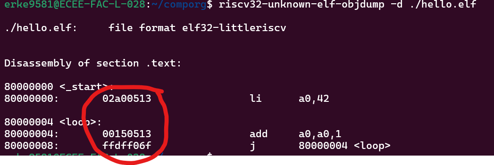
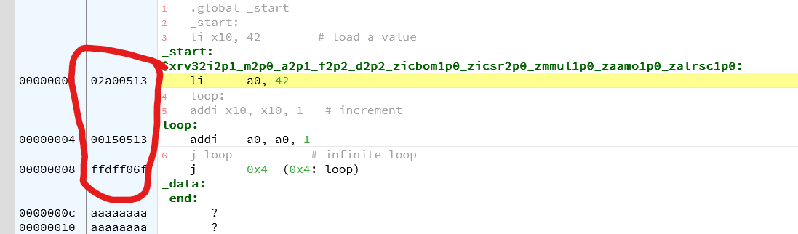

# Phase1-Tooling

The tasks are:

**TASK 1** 

Write an assembly program, phase1.S consisting of the following lines of code:

``` riscv-asm
.global _start
_start:	
    li x10, 42        # load a value
	addi x11, x10, 3
	add x11, x10, x11
	addi x12, x0, 7
```

Add the file to the github repo (place the file in the top level directory)

**TASK 2** 

Run that program and take a screenshot showing the register values x0-x31.  Place that screenshot in a file called screen-shot1 (with whatever extension your screenshotting software stores in, e.g., .png).  See instructions on Canvas (Compiling and Running RISC-V Programs).  Preferred is if you at least try to follow the local instructions (local binutils, local qemu, local gdb), but online with cpulator is accepable. 

Add the file to the github repo (create a directory called out and place the file in that directory)


**TASK 3** 

Run the provided code in icarus verilog (preferred is at least try local, but using edaplayground is acceptable), which will load from the file init.mem and run for some time period.  Open gtkwave, expand to show waves for all variables (recursive), and take a screenshot -- call it screen-shot2 (with whatever extension).  See canvas for instructions (System Verilog Resources).  In our example, the waveform is in simulation_results.vcd.

Add the file to the github repo (place the file in the out directory)

**TASK 4** 

From the assembly program called phase1.S, create a file init-\<your-identikey\>.mem (e.g., init-erke9581.mem) with one line per instruction in.  Preferred method is with objcopy and hexdump (see canvas), but you can also use objdump to disassemble (and manually copy the machine code) manually copy from cpulator (screenshots below).

Add the file to the github repo (place the file in the top level directory)

Objdump:


cpulator:


**TASK 5** 

Edit the SystemVerilog code (file system.sv) to change reference to init.mem to init-\<your-identikey\>.mem.  Run the testbench again and take a similar screenshot, calling the file screen-shot3 (with whatever extension).

Add the file to the github repo (place the file in the out directory)


## Summary
You should have added:
* phase1.S
* out/screen-shot1.png (or other extension)
* out/screen-shot2.png (or other extension)
* out/screen-shot3.png (or other extension)
* init-erke9581.mem (with your identikey instead)

You should have modified:
* system_tb.sv

All should be committed and pushed to github.

**Do not add any other file (like phase1.o or phase1.elf) to the git repo.**


